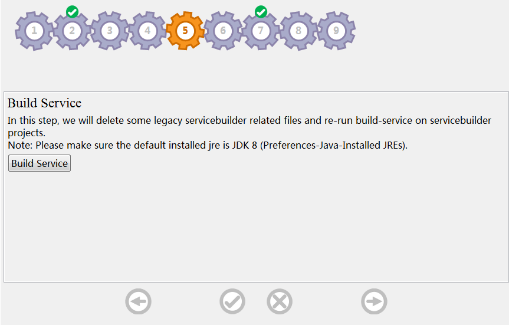

# Build Service

This page helps user to build a service from a service.xml file. It will delete some legacy servicebuilder related files and rerun build-service.

*Notes: Java 8 is required. To set this go to Window &rarr; Preferences &rarr; Java &rarr; Installed JREs* 

1. Click on `Build Service` button.it will recognized projects with service.xml file automatically.
2. The *Project Selection* window will popup,you can select or deselect projects,then click on **OK** button. 
3. You can see the outputs in Console.