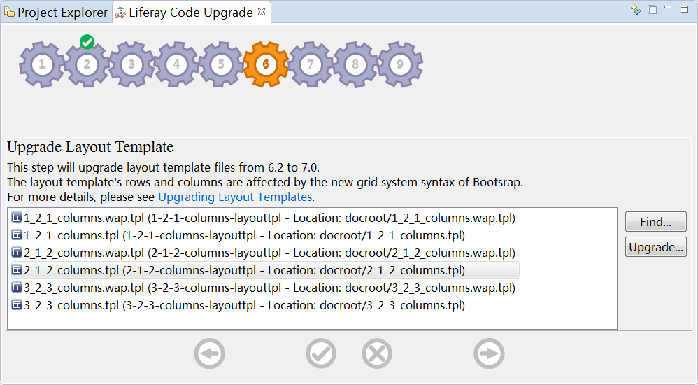
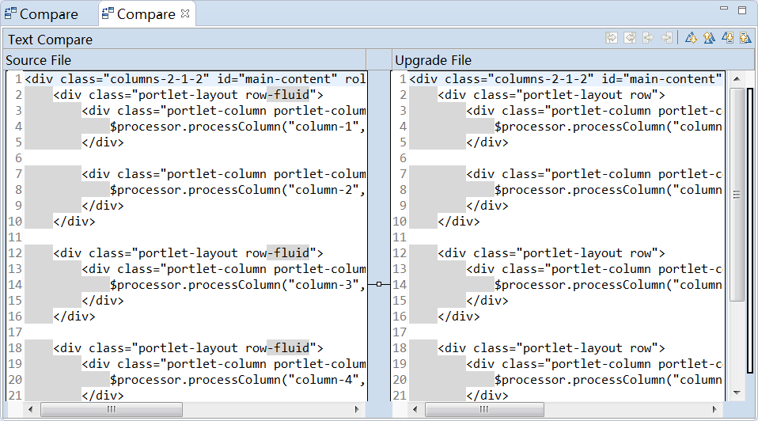
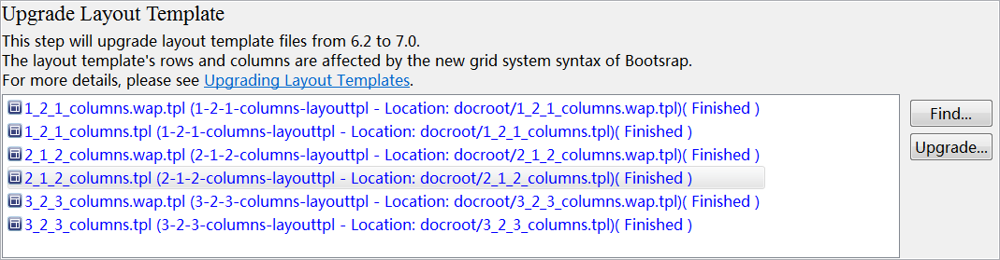
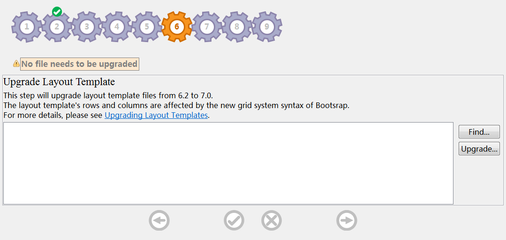

# Upgrade layout Template

This page helps to upgrade layout template files from 6.2 to 7.0. 

Double click on a specific file in the list. It will pop up a comparison page which shows the differences between your original source file and expected upgrade preview file.

You can upgrade template files automatically by clicking on `Upgrade...` button. The files will be highlighted after upgraded. 

You can try `Find...` or `Upgrade...` again. There will be an warning message if no files need to be upgraded.

